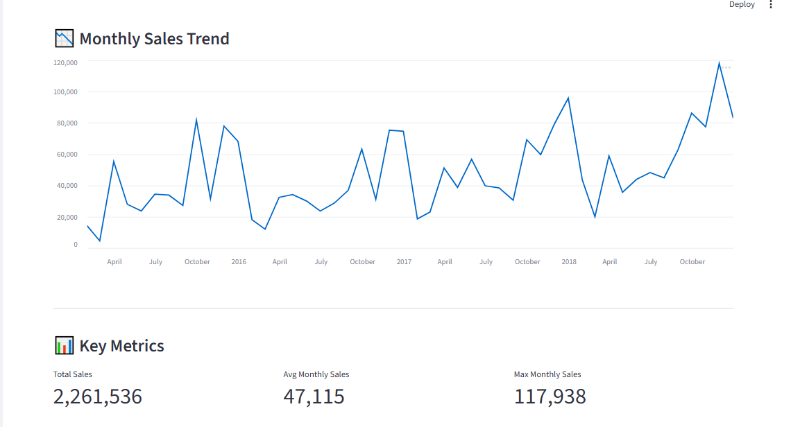
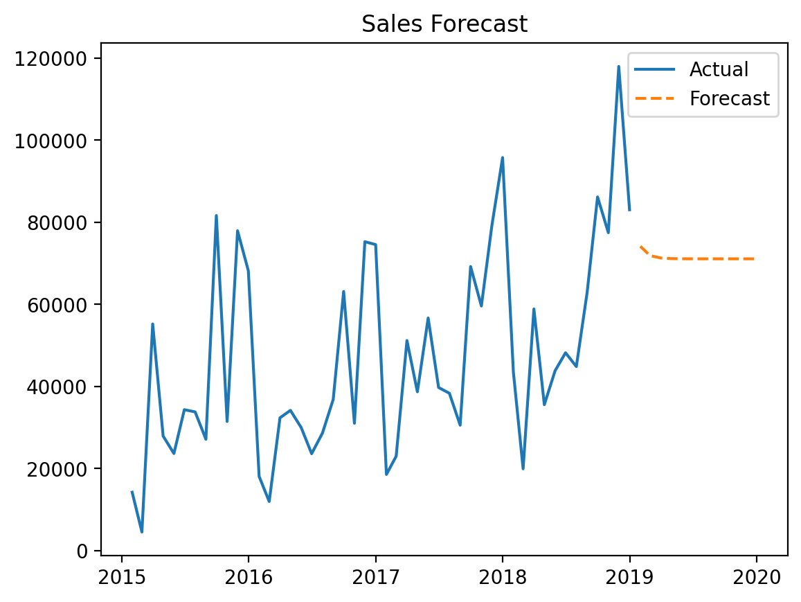

# 📊 Sales Forecasting Dashboard

## 🚀 Live Demo

https://sales-forecast-dashboard-kxzh3m7itdudwlsbatmjkh.streamlit.app/

---

## 📌 Project Overview

This project is an interactive **Sales Forecasting Dashboard** built using Python and Streamlit.
It allows users to upload sales data, analyze trends, visualize performance, and predict future sales using time series forecasting.

The goal of this project is to demonstrate **data analysis, visualization, and forecasting skills** in a real-world scenario.

---

## 📊 Features

* 📁 Upload and preview CSV datasets
* 🧹 Data cleaning and preprocessing
* 📈 Sales trend analysis (raw & monthly)
* 📊 Key metrics (Total, Average, Max sales)
* 🏆 Top-performing products analysis
* 📉 Product comparison visualization
* 🔮 Sales forecasting using ARIMA model
* 🧠 SQL queries for equivalent analysis

---

## 🛠 Tech Stack

* **Python**
* **Pandas** – Data manipulation
* **NumPy** – Numerical operations
* **Matplotlib** – Data visualization
* **Streamlit** – Interactive dashboard
* **Statsmodels (ARIMA)** – Forecasting
* **SQL** – Data querying

---

## 📊 Dashboard Preview

### 📈 Monthly Sales Trend



### 🔮 Sales Forecast



### 📊 Full Dashboard


---

## 🧠 Key Insights

* Monthly aggregation helps reduce noise and reveals clearer trends
* A small number of products contribute significantly to total revenue
* Sales show an overall increasing trend over time
* Forecast suggests relatively stable future performance

---

## 🧾 SQL Queries Used

```sql
-- Top 5 Products by Sales
SELECT product, SUM(sales)
FROM sales_data
GROUP BY product
ORDER BY SUM(sales) DESC
LIMIT 5;

-- Monthly Sales Trend
SELECT DATE_TRUNC('month', order_date) AS month, SUM(sales)
FROM sales_data
GROUP BY month
ORDER BY month;

-- Total Sales
SELECT SUM(sales) FROM sales_data;

-- High Value Transactions
SELECT *
FROM sales_data
WHERE sales > 1000;
```

---

## 🎯 Learning Outcomes

* Applied data cleaning and preprocessing techniques
* Built interactive dashboards using Streamlit
* Performed exploratory data analysis (EDA)
* Implemented time series forecasting using ARIMA
* Translated Python-based analysis into SQL queries

---

## 👤 Author

**Rafique Ali Merchant**
BSc Data Science Student

* 📍 Mumbai, India
* 📧 [rafiquealimerchant@gmail.com](mailto:rafiquealimerchant@gmail.com)
* 🔗 LinkedIn: https://www.linkedin.com/in/rafiqueali-merchant-771159364

---

## ⭐ Final Note

This project demonstrates the ability to **work with real datasets, extract insights, and build deployable data applications**, making it suitable for Data Analyst and Data Science internship roles.
